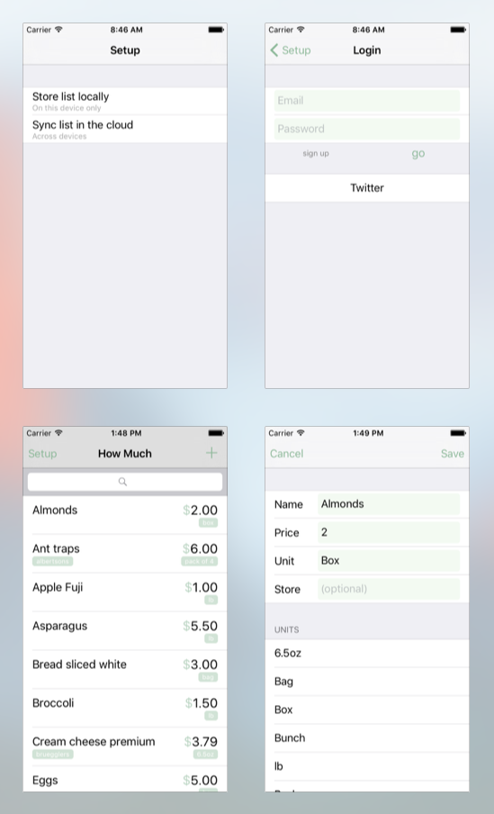

# How Much

Simple iOS app to record how much things cost using Parse



## Getting Started

1. Create a Parse data app to store data in the cloud (optional) https://parse.com/apps/quickstart
- Create a Twitter app to sign in with Twitter (optional) https://apps.twitter.com/
- How Much uses https://cocoapods.org 

``` 
git clone https://github.com/dkhamsing/how-much.git
cd how-much/Xcode
pod install
```

## App Icon 

https://thenounproject.com/term/dollar-sign/185240/

## Thanks 

- https://github.com/ParsePlatform/Parse-SDK-iOS-OSX
- https://github.com/TransitApp/SVProgressHUD 
- https://github.com/tonymillion/Reachability   
- and [more](Xcode/Podfile)
    
## Contact

- [github.com/dkhamsing](https://github.com/dkhamsing)
- [twitter.com/dkhamsing](https://twitter.com/dkhamsing)
